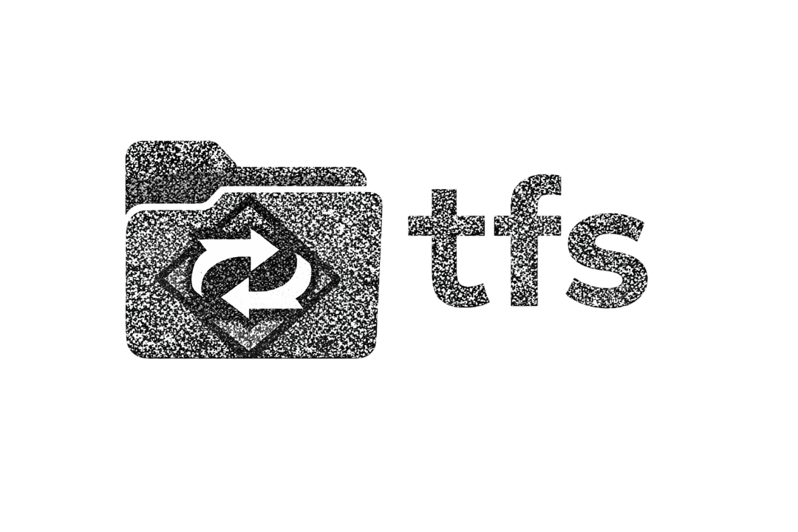

<div style="background-color: #1e1e1e; padding: 1em; display: inline-block; border-radius: 8px;">
  
</div>
`tfs` is a **transactional filesystem operation engine** designed for two audiences:

* **Humans** who want a safer, more explicit alternative to ad-hoc `mv` / `cp` scripting
* **AI agents** that require deterministic behavior, strict JSON schemas, and reversible operations

`tfs` follows the Unix philosophy strictly.
It does **not** walk directories, infer intent, or guess destinations.
It consumes **explicit manifests**, applies **deterministic operations**, and guarantees **reversible, transactional filesystem changes**.

---

## Features

* **Transactional filesystem operations**
  Apply multiple moves/copies atomically (`transaction = all`) or per-operation.

* **Explicit scope**
  Operates only on paths named in the manifest or CLI arguments. No implicit traversal.

* **Built-in rollback**
  Every destructive operation is journaled and can be undone safely.

* **Safe previews**
  `--dry-run` and `--validate-only` modes perform no writes.

* **Structured automation**
  JSON manifests, JSON Schema (`tfs schema`), and structured event output for agent tooling.

* **Collision policies**
  Explicit handling for destination conflicts (`fail`, `suffix`, `hash`, `overwrite_with_backup`).

* **Root confinement**
  All operations are confined to a declared root directory.

---

## Documentation

* **Developer guide:** `HACKING.md`
* **Architecture/design notes:** `DESIGN.md`
* **Journal format:** `docs/JOURNAL.md`
* **JSON schema:** via `tfs schema`

---

## ⚡ Quick Start

### Preview a Move (No Writes)

```bash
cat <<EOF > fs.json
{
  "root": "/home/me/Downloads",
  "transaction": "all",
  "operations": [
    { "op": "move", "src": "a.txt", "dst": "Docs/a.txt" }
  ]
}
EOF

tfs apply --manifest fs.json --dry-run
```

Nothing is written. No directories are created.

---

### Apply Transactionally

```bash
tfs apply --manifest fs.json --json
```

If any operation fails, **nothing is committed**.

---

### Undo a Transaction

```bash
tfs undo --journal txn.jsonl
```

Undo relies on the journal, not filesystem heuristics.

---

## 📚 CLI Guide

### Synopsis

```bash
tfs schema
tfs apply --manifest FILE [OPTIONS]
tfs undo --journal FILE
```

---

### Commands

**`schema`**
Print the JSON Schema describing `tfs` manifests and operations.

```bash
tfs schema > tfs_schema.json
```

---

**`apply --manifest FILE`**
Validate, preview, or apply a filesystem transaction.

Options:

* `--dry-run` – simulate only
* `--validate-only` – schema + policy validation only
* `--json` – structured output
* `--journal FILE` – write journal to a specific path

---

**`undo --journal FILE`**
Undo a previously applied transaction using its journal.

---

## Manifests

`tfs` operates exclusively on **explicit manifests**.

### Minimal Manifest

```json
{
  "root": "/home/me/Downloads",
  "transaction": "all",
  "operations": [
    { "op": "mkdir", "dst": "Images" },
    { "op": "move", "src": "photo.jpg", "dst": "Images/photo.jpg" }
  ]
}
```

Rules:

* `root` must be absolute
* `src` / `dst` are relative to `root` unless absolute
* No operation may escape the root

---

### Supported Operations

* `mkdir`
* `move`
* `copy`
* `rename` (alias for move within same directory)
* `trash` (optional; moves to quarantine)

There is **no delete operation**.

---

## Collision Policies

Collisions are never silent.

Supported policies (manifest-level or CLI override):

* `fail` (default)
* `suffix` (`_2`, `_3`, …)
* `hash8` (append short hash)
* `overwrite_with_backup` (requires explicit opt-in)

If a policy is not explicitly allowed, the operation fails.

---

## Safety Guarantees

`tfs` guarantees:

* No file is deleted permanently
* No overwrite occurs by default
* No partial application in `transaction = all`
* No path escapes the declared root
* Undo never guesses filesystem state

If a change cannot be undone, it is not allowed.

---

## Journals

Every applied transaction produces a **journal**:

* NDJSON (JSON Lines)
* Append-only
* Sufficient to undo or resume

The journal is the **source of truth** for undo.

Undo does not rely on filesystem inspection.

---

## Agent Mode

`tfs` is designed for autonomous agents.

Agents typically:

1. Generate a manifest
2. Run `tfs apply --dry-run`
3. Inspect structured output
4. Run `tfs apply`
5. Store the journal ID

Schemas and event streams are stable, versioned APIs.

---

## 📊 Performance Notes

`tfs` prioritizes:

* correctness
* safety
* determinism

Raw throughput is secondary.
Fast, unsafe filesystem mutation belongs in shell scripts, not here.

---

## 📦 Installation

```bash
# From local checkout
cargo install --path .

# From git (replace with repo URL)
cargo install --git <REPO_URL>
```

Requires Rust 1.86+.

---

## Exit Codes

* `0` success
* `1` operational failure (I/O, permissions)
* `2` policy failure
* `3` transactional failure (aborted)

---

## Relationship to `txed`

`tfs` and `txed` are siblings:

* `txed` edits **content**
* `tfs` edits **paths and files**

Both share the same philosophy:

* explicit inputs
* deterministic execution
* transactional semantics
* agent-safe APIs

Together, they form a safe foundation for automated refactoring and filesystem manipulation.

---

## License

MIT
